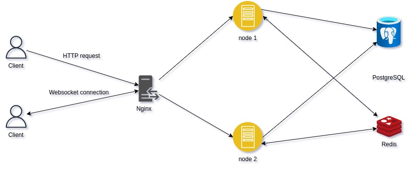
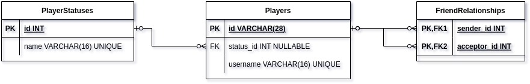

# Overview

A server supports the most basic things for player - player, and player - group communication in **game client**.
# Features

- [x] Firebase Authentication
- [ ] User
  - [x] Get friend list
  - [ ] Add friend
  - [ ] Remove friend
  - [x] Receive friend status changes
- [x] Room
  - [x] Leave room
  - [x] Notify room changes
  - [x] Room
    - [x] Book room
    - [x] Join room
    - [x] Kick out of room
    - [x] Transfer ownership
    - [x] Create rooms
    - [x] Mute room
    - [x] Remove rooms
    - [x] Add members
    - [x] Remove members
- [x] Message
  - [x] Send private message
  - [x] Send room message
- [ ] Others
  - [x] Logging
  - [x] Scalable
  - [ ] CORS

# Tools And Technologies

- [NestJS](https://nestjs.com/)
- [Socket.IO](https://socket.io/)
- [Prisma](https://www.prisma.io/)
- [RESTful API](https://restfulapi.net/)
- [NGINX Web Server](https://en.wikipedia.org/wiki/Nginx)
- [Redis](https://redis.io/)
- [Redis Commander](https://github.com/joeferner/redis-commander)
- [PostgreSQL](https://www.postgresql.org)
- [Adminer](https://www.adminer.org)
- [Firebase Authentication](https://firebase.google.com/docs/auth)
- [Docker](https://www.docker.com)
- [Docker Compose](https://docs.docker.com/compose)

# Details

## Architecture



## Database Design



## Documentaions

RESTful API [here](https://game-upgrader.github.io/werewolf/communication/docs/api)

Event-Driven API [here](https://game-upgrader.github.io/werewolf/communication/docs/event)

# Setup

```bash
$ git clone git@github.com:game-upgrader/werewolf.git

$ cd werewolf/communication

$ cp config.example.yaml config.yaml
```

## Development

```bash
$ docker-compose up -d

$ docker-compose exec app npx prisma migrate dev
```

# License

This project is distributed under the [MIT License](LICENSE)

Copyright of [@TP-O](https://github.com/TP-O), 2023
